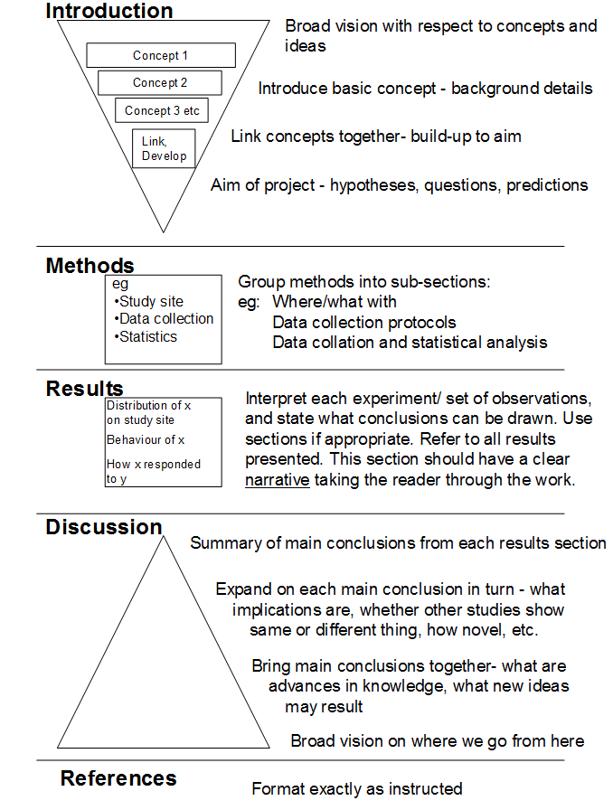

# The last part of any quantitative modelling

Depending on your preferences, this is either the easiest part, or the most difficult! Analysing and interpretating your data is not the whole story: you have to write it up as a report. Most of us find this the most difficult step, and easily get writer's block, especially with Microsoft Word: type in the word **Introduction** and look at a blank, white screen. Most reports you will write on this and other courses, especially Stage 3, and for your Stage 3 project, will probably follow the format of

-   Abstract
-   Introduction
-   Methods
-   Results
-   Discussion
-   References

That might be how it is written, but the order many scientists draft the final version might be easier in the order of:

1.  Methods (I know what I did, so this is easy to write. Phew! One section written...)

2.  Results (I know what I've obtained from my analyses, and have created various graphs and tables to support them. Making progress, two sections written...)

3.  Discussion (now I can go ahead and interpret my results in the context of existing scientific literature, discuss where it accords or contrasts with previous research, and explore possibilities for further research...)

4.  Introduction (given that the rest has now been written, this is much easier to write as I know what I'm about to introduce.)

5.  References (of course, before you even begin your experiments / surveys, you need to have a good knowledge of the literature. I recommend you also use bibliographic software, such as [Zotero](www.zotero.org), which automatically creates references for you)

6.  Abstract (a good abstract is suprisingly difficult to write. It needs to be concise, precises, and quickly communicate your findings. A good title is of course also essential.)

Many scientists use the "hourglass" model as a way of thinking about how to structure scientific papers which you may have come across in Stage 1:

We also particularly recommend you look at [this post](https://dynamicecology.wordpress.com/2016/02/24/the-5-pivotal-paragraphs-in-a-paper/) which describes the **5 key paragraphs of any scientific paper**. It is written by an ecologist, but is actually applicable to any discipline. The same site also provides [some useful tricks for clear writing](https://dynamicecology.wordpress.com/2012/11/14/clear-writing/). 
 