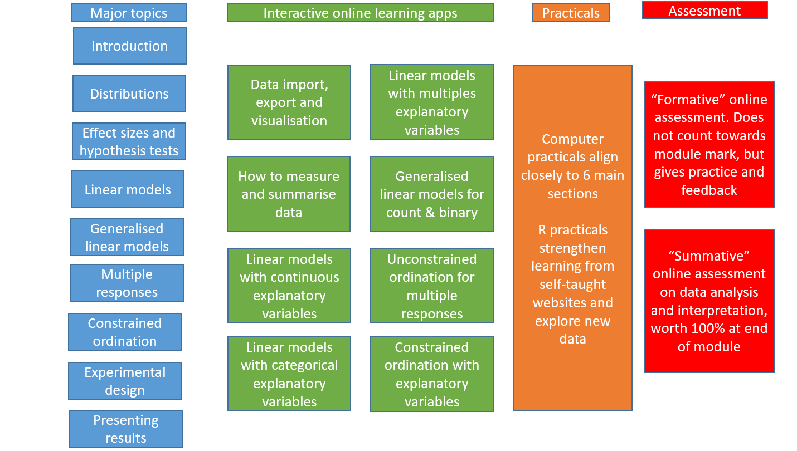

# Data Analysis course structure

There will be a couple of introductory lectures from Roy Sanderson at the start of the course, but the focus will be on practical sessions. If for health or other reasons you are not able to attend the computer classes on Campus, then you should still be able to complete the course without problems. **We will use Microsoft Teams** to answer questions, as students can **help each other** more easily, and staff or demonstrators can **respond more quickly**.

The following diagram summarises the overall course structure

-   Blue - broad topics shown on the left
-   Green - 6 major sections for the NES2303 course (see below)
-   Orange - Computer practical sessions; these map onto the 6 topics
-   Red - Formative and Summative assessments

Teaching staff and many demonstrators will be from the Modelling Evidence and Policy Research Group (MEP) <https://www.ncl.ac.uk/nes/our-research/biology/modelling-evidence-policy/> within SNES. The group includes Biologists and Zoologists working in many different fields, from microbiology through to field zoology, but all these areas require solid data analysis and interpretation. The formative and summative tests will be hosted on the Canvas Virtual Learning Environment, but will require you to analyse and interpret data separately. The tests will take the form of short-answer / multiple choice / numeric answers.

## Lecture structure

An Introductory lecture from Roy Sanderson (Module Leader) in Week 4, 'quantitative foundations' lecture in Week 5, and a final informal Question and Answer session in Week 14 to answer any outstanding queries on your understanding of course content, and help you prepare for the Summative Assessment in January.

## Interactive websites

We have created **interactive websites** for this course, for you to learn and practice ideas **before and after** the practicals. These websites include simple quizzes to test your understanding. In the practicals you will be able to explore the example data shown on the websites in more depth, and hone your skills using new data. If you study the interactive websites **before** attending the relevant practical, you will find the latter much simpler, and gain more from it.

## Computer classes

These are scheduled for seven weeks (Week 4 to Week 11 - Week 10 is 'Enrichment Week' with no teaching) in the main Herschel Building cluster room (Fell) on the first floor.

## Ten-minute videos (TMV)

I have prepared a series of short (5 to 10 minutes) animated videos to explain in simple, non-technical terms some quantitative biology concepts. These have been gradually introduced to the course over the last 2 years, and students have found them helpful. They deliberately avoid complex maths, and build up key concepts sequentially to aid your understanding.

## Cheatsheet

There is a lot of new information to absorb in this module so I've prepared a 2-page quick-reference "cheatsheet" with the main statistical analyses. This will probably be incomprehensible to you at the start of this course (don't panic!), but should soon be a valuable resource to help you as you progress and develop your understanding.

## Managing your workload

This is a 10-credit module so assumes you will devote 100 hours of study time. There are 7 practicals and two lectures, so you would theoretically do 86 hours of self-directed study. In practice, you won't need 86 hours (phew!) but please do make use of the extensive online resources on Canvas, especially the Ten-Minute Videos and Interactive Websites. I have provided a page on Canvas to help you plan and manage the workload for NES2303, with a week-by-week diary throughout Semester One.
