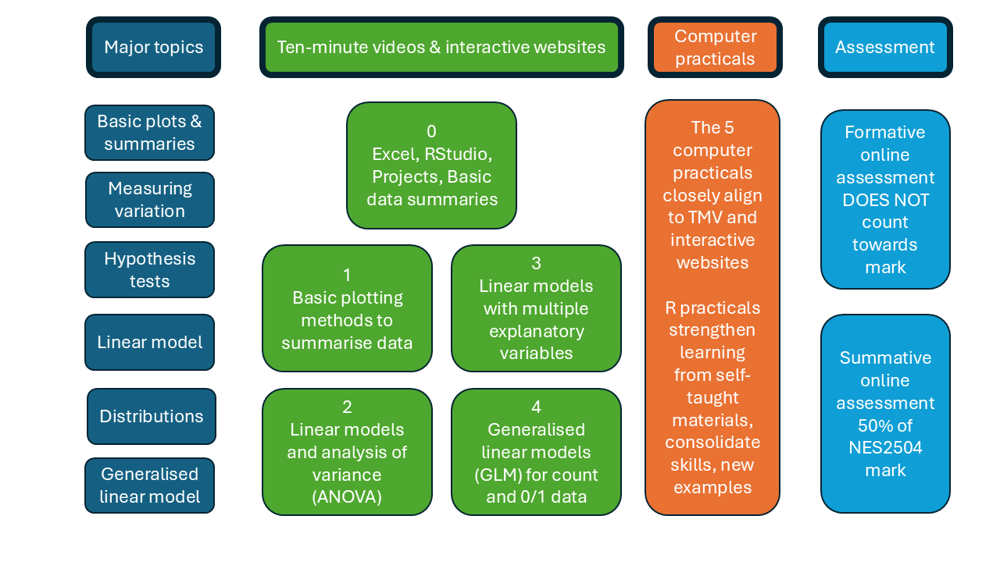

# Data Analysis course structure

There will be an introductory lecture at the start of the Data Analysis course, but the focus will be on practical sessions. If for health or other reasons you are not able to attend the computer classes on Campus, then you should still be able to complete the course without problems. If you miss a computer class it is **ESSENTIAL** that you complete the one you missed before moving to the next one, otherwise you will be baffled and lost.

The following diagram summarises the overall course structure

-   Blue - broad topics shown on the left
-   Green - 5 major sections for the Data Analysis course (see below)
-   Orange - Computer practical sessions; these map onto the 6 topics
-   Red - Formative and Summative assessments

Teaching staff and many demonstrators will be from the Modelling Evidence and Policy Research Group (MEP) <https://www.ncl.ac.uk/nes/our-research/biology/modelling-evidence-policy/> within SNES. The group includes Biologists, Marine Scientists and Zoologists working in many different fields, from microbiology through to field zoology, but all these areas require solid data analysis and interpretation. The formative and summative tests will be hosted on the Canvas Virtual Learning Environment, but will require you to analyse and interpret data separately. The tests will take the form of short-answer / multiple choice / numeric answers.

## Lecture structure

An Introductory lecture from Roy Sanderson first week of teaching to outline the Data Analysis component within the module as a whole and answer any initial queries from students.

## Interactive websites

We have created **interactive websites** for this course, for you to learn and practice ideas **before and after** the practicals. These websites include simple quizzes to test your understanding. In the practicals you will be able to explore the example data shown on the websites in more depth, and hone your skills using new data. If you study the interactive websites **before** attending the relevant practical, you will find the latter much simpler, and gain more from it.

## Computer classes

These are scheduled for five weeks. You have been split into **two groups** of students so **check your timetable**. Most of you (c. 115 students) will be with Roy Sanderson in Herschel Building, the remainder (c. 85 students) with Will Reid in Dame Barbour Building. **NOTE** Unfortunately majority of Herschel classes are timetabled 16:00-18:00 which is poor for students commuting, who have caring responsibilities, part-time jobs etc. Feel free to start your computer practicals in your own time if this might be a problem.

## Ten-minute videos (TMV)

We have prepared a series of short (5 to 10 minutes) animated videos to explain in simple, non-technical terms some quantitative biology concepts. These have been gradually introduced to the course over the last 2 years, and students have found them helpful. They deliberately avoid complex maths, and build up key concepts sequentially to aid your understanding.

## Cheatsheet

There is a lot of new information to absorb in this module so I've prepared a 2-page quick-reference "cheatsheet" with the main statistical analyses. This will probably be incomprehensible to you at the start of this course (don't panic!), but should soon be a valuable resource to help you as you progress and develop your understanding.

## Managing your workload

This component is worth 50% of a 20-credit module so assumes you will devote 100 hours of study time. There are only 5 x 2 hour practicals and one lecture, so you would theoretically do 89 hours of self-directed study. In practice, you won't need 89 hours (phew!) but please do make use of the extensive online resources on Canvas, especially the Ten-Minute Videos and Interactive Websites. Plan your workload carefully week-by-week throughout Semester One, in comparison with your other modules.
